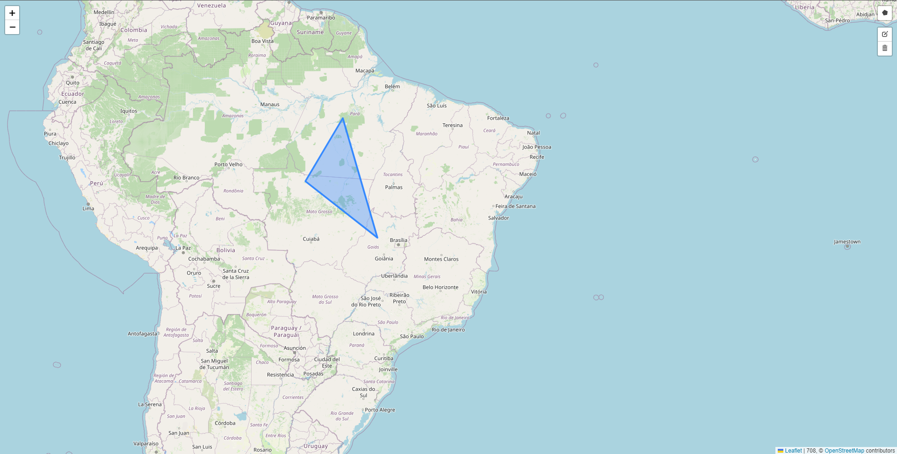
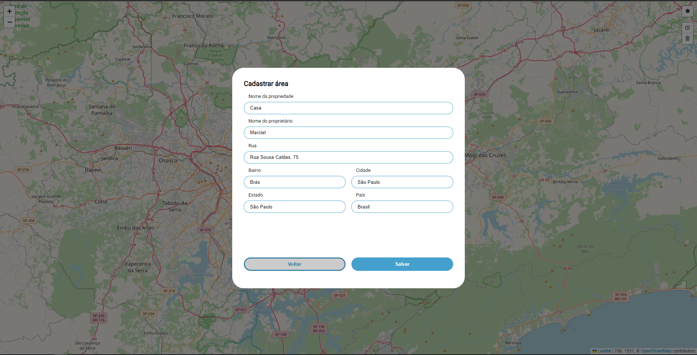

# Map-Challenge

Challenge proposed in the selection process of company x

## Deploy

- [Access](https://map-challenge.marcielfelipe.com/)

## About the Challenge 🤯

 There is a high demand for registering property areas for our clients. To solve this problem, we would like to create a platform with the following functionalities:

- Home screen with the rendering of the Map;
- Be able to draw the property area on the map [Polygon];
- After completing the drawing of an area, display a modal with a form  containing the following fields:
  - Property Name
  - Owner's Name
  - Address - [Street, Neighborhood, City, State, and Country];
- Use the "Google Geocoding API" to search for the address and automatically fill in the fields [Street, Neighborhood, City, State, and Country];
- Save Property data;
- When clicking on the Property area, display a modal with the details of the property.
- Option to delete and edit the area and property information.
- Data should be saved in local storage.

## Demo




## Running locally

Clone the project

```bash
  git clone https://github.com/marcielfelipe/map-challenge.git

Navigate to the project directory

```bash
  cd map-challenge
```

Install dependencies

```bash
  npm install
  or
  yarn
```

Start the server

```bash
  npm run start
  or
  yarn start
```

## Used Stack

- [react](https://react.dev/)
- [next.js](https://nextjs.org/)
- [styled-components](https://styled-components.com/docs)
- [leaflet](https://leafletjs.com/)

#### Maps

- [react-leaflet](https://react-leaflet.js.org/)
- [react-leaflet-draw](https://www.npmjs.com/package/react-leaflet-draw)
- [react-leaflet-draw](https://www.npmjs.com/package/react-leaflet-draw)

#### Form Validation

- [react-hook-form](https://www.npmjs.com/package/react-leaflet-draw)
- [react-hook-form](https://www.npmjs.com/package/react-leaflet-draw)
